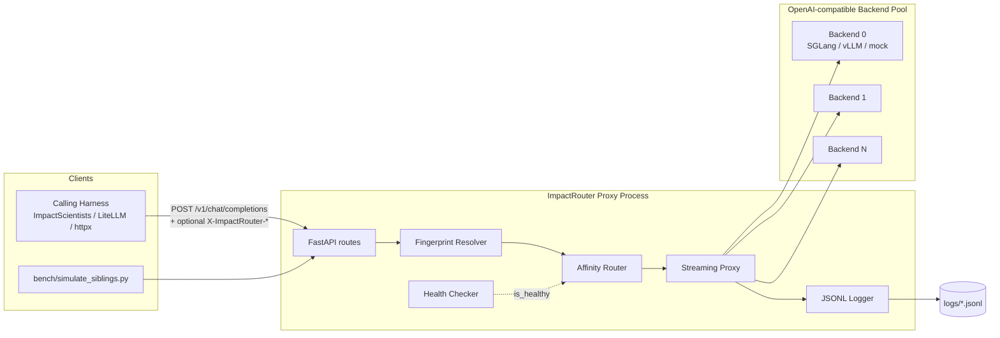
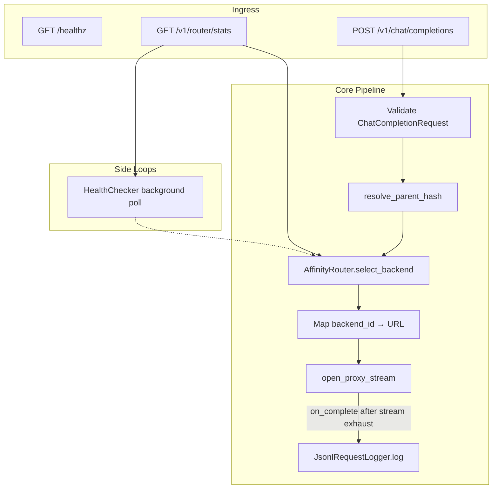
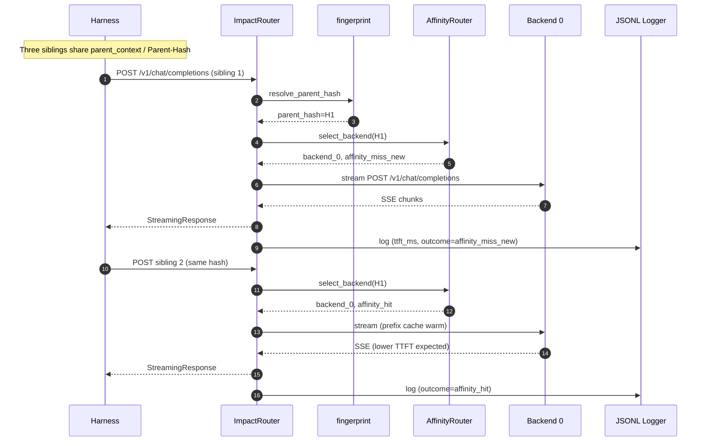
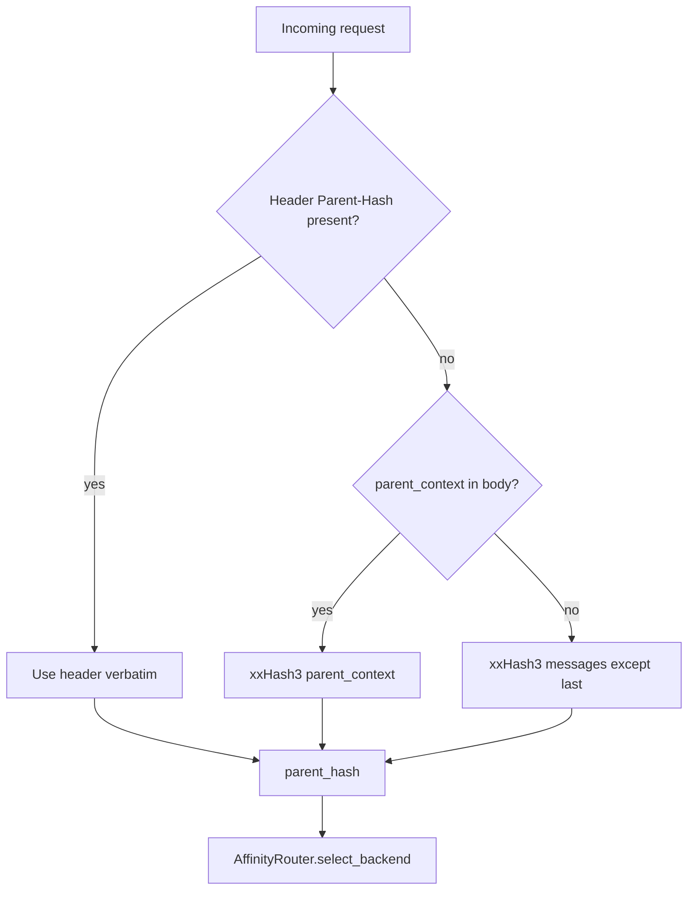
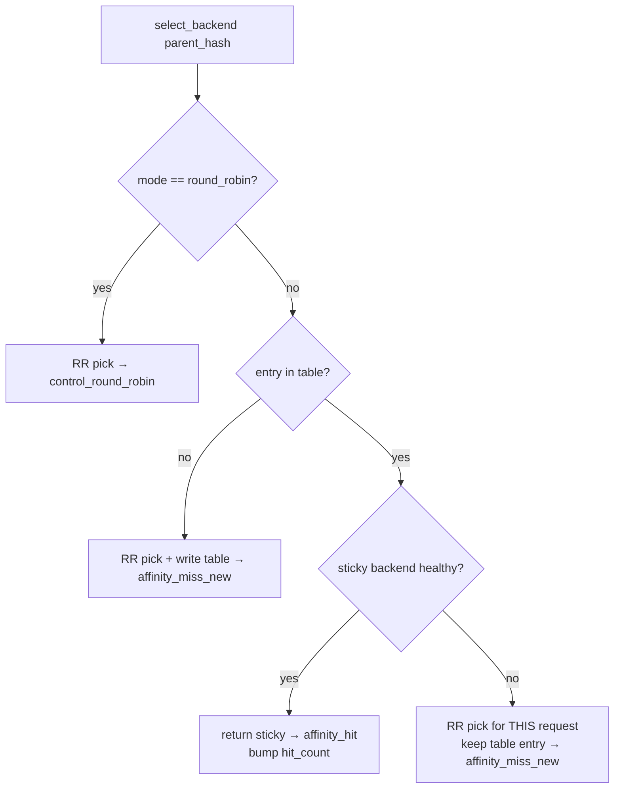
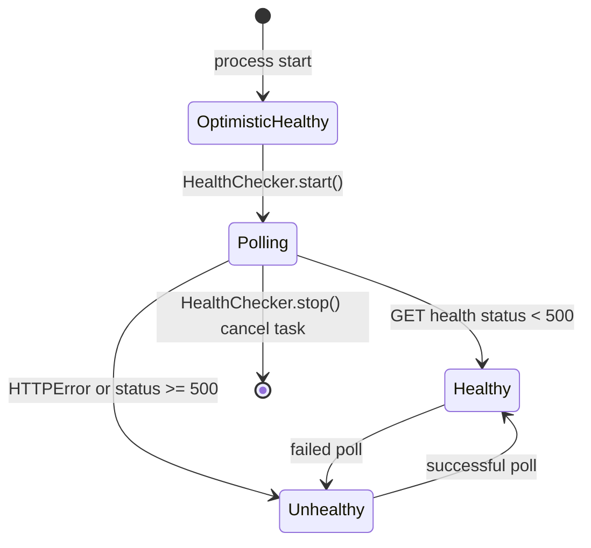
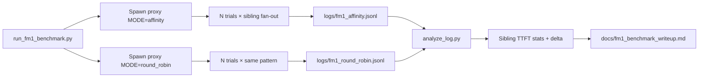
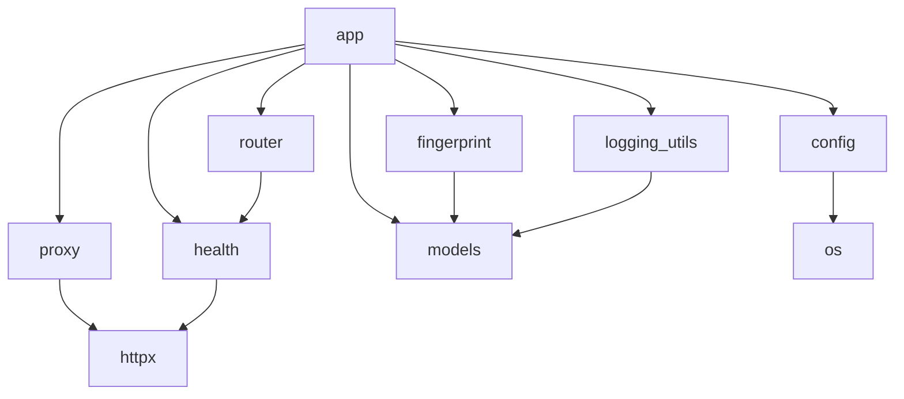

# ImpactRouter — System Architecture

**Status:** v1 research prototype · **Scope:** Python-only, single-process, in-memory  
**Primary sources:** [`PRD.md`](../PRD.md), [`src/impactrouter/`](../src/impactrouter/), [`bench/`](../bench/)  
**Codename history:** StateFlow Gateway → ImpactRouter

This document is the architecture reference for ImpactRouter: system context, component design, end-to-end workflows, data contracts, evaluation pipeline, design decisions, and foundational knowledge markers for interviews / onboarding.

---

## Table of Contents

1. [Executive Summary](#1-executive-summary)
2. [Problem Framing & Positioning](#2-problem-framing--positioning)
3. [System Context](#3-system-context)
4. [Logical Architecture](#4-logical-architecture)
5. [Physical / Runtime Architecture](#5-physical--runtime-architecture)
6. [Component Catalog](#6-component-catalog)
7. [End-to-End Workflows](#7-end-to-end-workflows)
8. [Data Models & Contracts](#8-data-models--contracts)
9. [Routing Algorithm Deep Dive](#9-routing-algorithm-deep-dive)
10. [Observability & Measurement](#10-observability--measurement)
11. [Benchmark / Evaluation Architecture](#11-benchmark--evaluation-architecture)
12. [Configuration Surface](#12-configuration-surface)
13. [Security, Reliability & Non-Goals](#13-security-reliability--non-goals)
14. [Testing Architecture](#14-testing-architecture)
15. [Repository Map](#15-repository-map)
16. [Design Decisions (ADRs)](#16-design-decisions-adrs)
17. [Foundational Knowledge Markers](#17-foundational-knowledge-markers)
18. [Glossary](#18-glossary)
19. [Open Risks & Future Directions](#19-open-risks--future-directions)

---

## 1. Executive Summary

ImpactRouter is a **drop-in OpenAI-compatible HTTP proxy** that sits in front of a pool of LLM inference backends (SGLang / vLLM). Its single job is to ensure that **sibling agent calls sharing the same parent context land on the same backend instance**, so the engine’s own prefix cache (RadixAttention / PagedAttention) can reuse a long shared prefix.

It is **not** a production load balancer. The deliverable is a falsifiable measurement: the **TTFT (time-to-first-token) delta** between affinity-routed and naively round-robin-routed sibling fan-out (FM-1).

| Attribute | v1 Choice |
|-----------|-----------|
| Language | Python 3.11+ |
| Server | FastAPI + uvicorn, single process / single event loop |
| Routing state | In-memory `dict`, process-local, no persistence |
| Fingerprint | xxHash3-64 hex digest |
| Forwarding | `httpx` async streaming passthrough |
| Measurement | Per-request JSONL with `ttft_ms` |
| Auth / multi-tenant | None (explicit non-goal) |

---

## 2. Problem Framing & Positioning

### 2.1 The Sibling Routing Problem (FM-1)

In multi-agent workflows, several agents often fan out from one parent context in parallel (e.g. ImpactScientists Phase 3: Quick Theorist, Quick Engineer, Quick DA evaluating the same idea). They share a long identical prefix; only the final instruction differs.

A topology-unaware balancer scatters siblings across instances → each independently prefills the same prefix → wasted compute and inflated TTFT. The serving engine cannot fix this alone: it has no application-layer topology signal.

### 2.2 Pre-hoc vs Post-hoc Sharing

| Approach | When sharing is known | Mechanism | Examples |
|----------|----------------------|-----------|----------|
| **Pre-hoc (ImpactRouter)** | Before any request is sent | Explicit header / parent hash → sticky backend | ImpactRouter |
| **Post-hoc** | After requests arrive / tokens inspected | Overlap discovery, comparison overhead | TokenDance, KVCOMM |

ImpactRouter’s differentiation: **deterministic, zero-comparison affinity** — hash lookup only.

### 2.3 Complementary Systems (Not Competitors)

| System | Solves | ImpactRouter relationship |
|--------|--------|---------------------------|
| Engine prefix cache (RadixAttention / PagedAttention) | Reuse KV within an instance | ImpactRouter makes reuse *possible* by co-locating siblings |
| KVFlow | Workflow-aware eviction (*what to keep*) | Complementary |
| Continuum | KV-cache TTL scheduling (*for how long*) | Complementary |

**Framing rule:** ImpactRouter decides *where to send*; engines and eviction systems decide *what stays cached*.

---

## 3. System Context



**Trust / deployment boundary (v1):** local laptop or benchmark environment only. No multi-tenant edge, no public internet exposure assumed.

---

## 4. Logical Architecture



### Layered view

| Layer | Responsibility | Modules |
|-------|----------------|---------|
| **API / presentation** | HTTP surface, header stripping, StreamingResponse | `app.py` |
| **Identity / fingerprint** | Parent-hash resolution precedence | `fingerprint.py` |
| **Routing policy** | Sticky affinity vs control RR | `router.py` |
| **Health** | Boolean reachability cache | `health.py` |
| **Transport** | Stream bytes, measure TTFT | `proxy.py` |
| **Telemetry** | Append-only JSONL | `logging_utils.py` |
| **Schema** | Pydantic request/log/stats models | `models.py` |
| **Config** | Env → frozen `Settings` | `config.py` |

There is **no** embedding model, similarity scorer, plugin registry, or message bus.

---

## 5. Physical / Runtime Architecture

```
┌─────────────────────────────────────────────────────────────┐
│  OS Process (uvicorn impactrouter.app:app)                  │
│  ┌───────────────────────────────────────────────────────┐  │
│  │  asyncio event loop                                   │  │
│  │  ├─ FastAPI request handlers                          │  │
│  │  ├─ HealthChecker._run() background Task              │  │
│  │  ├─ Shared httpx.AsyncClient (outbound to backends)   │  │
│  │  └─ AffinityRouter.table: dict[str, RoutingEntry]     │  │
│  └───────────────────────────────────────────────────────┘  │
│  Writes → logs/impactrouter_requests.jsonl (or mode-specific)│
└─────────────────────────────────────────────────────────────┘
         │ HTTP
         ▼
   Backend processes (separate; not owned by ImpactRouter)
```

**Implications:**

- Restart clears the routing table (acceptable for v1).
- Multi-worker / multi-process uvicorn would **shard** the table and break affinity — not supported.
- No Redis / DB / queue dependencies.

---

## 6. Component Catalog

### 6.1 `app.py` — Orchestrator

| Symbol | Role |
|--------|------|
| `AppState` | Process-wide singletons: settings, health checker, router, logger, httpx client |
| `create_app(settings?)` | Factory for testability; wires lifespan |
| `app` | Module-level ASGI app for `uvicorn impactrouter.app:app` |
| `chat_completions` | Main request pipeline |
| `router_stats` | Introspection snapshot |
| `healthz` | Proxy liveness (does not reflect backend health) |

**Header constants:**

- `X-ImpactRouter-Parent-Hash` — optional routing key (hex digest)
- `X-ImpactRouter-Scope` — optional, **log-only** in v1

**Not forwarded to backends:** `host`, `content-length`, `connection`, both ImpactRouter headers.

### 6.2 `fingerprint.py` — Parent Hash Resolver

```
precedence:
  1. X-ImpactRouter-Parent-Hash  (verbatim)
  2. xxh3_64(parent_context)
  3. xxh3_64(concat(messages[:-1].content))
```

Load-bearing property: **determinism** — identical input → identical hash within a process.

### 6.3 `router.py` — AffinityRouter

| Field / method | Meaning |
|----------------|---------|
| `table` | `parent_hash → RoutingEntry` |
| `mode` | `"affinity"` \| `"round_robin"` |
| `health_check` | Injected `Callable[[str], bool]` |
| `select_backend(parent_hash)` | Returns `(backend_id, routing_outcome)` |
| `_next_round_robin()` | Cycles `backend_0 … backend_N` |

**Outcomes:** `affinity_hit` | `affinity_miss_new` | `control_round_robin`

### 6.4 `proxy.py` — Streaming Passthrough

Split open/consume design:

1. `open_proxy_stream` opens backend stream, returns status + headers immediately.
2. Body iterator yields chunks; first non-empty chunk stamps TTFT.
3. On exhaust (or error path via `finally`), `on_complete(ProxyResult)` fires.

Excluded response headers: `content-length`, `content-encoding`, `transfer-encoding`, `connection`.

### 6.5 `health.py` — HealthChecker

- Optimistic: backends start `True` until first failed poll.
- Periodic `GET {base}{health_path}`; status `< 500` ⇒ healthy.
- On `HTTPError` ⇒ unhealthy.
- No latency weighting, no load scoring.

### 6.6 `logging_utils.py` — JsonlRequestLogger

Async append of one JSON object per completed proxied request. Schema must stay stable for `bench/analyze_log.py`.

### 6.7 `models.py` — Schemas

- `ChatCompletionRequest` — OpenAI-shaped + optional `parent_context`; `extra="allow"` for passthrough.
- `RequestLogEntry` — benchmark telemetry record.
- `RouterStatsResponse` / `BackendStats` / `HealthResponse`.

### 6.8 `config.py` — Settings

Frozen dataclass populated once from env via `load_settings()`. Backend IDs are index-based: `backend_0`, `backend_1`, …

### 6.9 `mock_backend.py` — Test / Logic Double

Configurable artificial delay SSE echo server (`GET /health`, `POST /v1/chat/completions`). Valid for routing-logic tests; **invalid** as sole source of publishable FM-1 TTFT numbers (no real prefix cache).

---

## 7. End-to-End Workflows

### 7.1 Happy Path — Affinity Sibling Fan-Out



**Expected cache story on a real backend:**

1. Sibling 1: routing miss + cache cold → baseline TTFT.
2. Siblings 2…N: routing hit → same instance → prefix-cache hit → lower TTFT.
3. Control (round_robin): siblings often land on different instances → repeated cold prefills.

### 7.2 Request Pipeline (Detailed Steps)

For every `POST /v1/chat/completions`:

| Step | Action | Code locus |
|------|--------|------------|
| 1 | Parse JSON → `ChatCompletionRequest` | `app.chat_completions` |
| 2 | Read `X-ImpactRouter-Parent-Hash`, `X-ImpactRouter-Scope` | headers |
| 3 | Resolve `parent_hash` | `resolve_parent_hash` |
| 4 | Select `(backend_id, routing_outcome)` | `AffinityRouter.select_backend` |
| 5 | Resolve URL via `settings.backend_id_to_url` | `AppState` |
| 6 | Build `forward_body` (strip `parent_context`) | `model_dump(exclude=…)` |
| 7 | Filter hop-by-hop / ImpactRouter headers | `_EXCLUDED_FORWARD_HEADERS` |
| 8 | `open_proxy_stream(...)` with `on_complete` | `proxy.py` |
| 9 | Return `StreamingResponse` to client | FastAPI |
| 10 | After stream exhaust, append JSONL | `JsonlRequestLogger` |

### 7.3 Fingerprint Resolution Workflow



### 7.4 Affinity vs Round-Robin Decision Tree



### 7.5 Health Checker Lifecycle



### 7.6 Unhealthy Sticky Backend Behavior

Critical design: if the sticky backend is unhealthy, ImpactRouter **does not rewrite** the table entry. It temporarily round-robins for that request (`affinity_miss_new`) so that when the sticky backend recovers, subsequent siblings can resume affinity.

### 7.7 Introspection Workflow

`GET /v1/router/stats` aggregates:

- Current `mode`
- `routing_table_size`
- Per-backend: URL, `healthy`, summed `hit_count` from table entries

### 7.8 FM-1 Benchmark Workflow



**Trial hygiene:** each trial uses a fresh `idea_id` / parent identity so cold-start vs sibling splits stay valid across trials.

---

## 8. Data Models & Contracts

### 8.1 Client → Proxy Headers

| Header | Required | Affects routing? | Notes |
|--------|----------|------------------|-------|
| `X-ImpactRouter-Parent-Hash` | No | Yes (if present) | Already-hex-encoded xxHash3 |
| `X-ImpactRouter-Scope` | No | **No (v1)** | Observability / session grouping only |
| Standard OpenAI / auth headers | As needed by backend | No | Forwarded except excluded set |

### 8.2 Request Body Addendum

```text
ChatCompletionRequest =
  OpenAI chat completion fields (model, messages, stream, …)
  + parent_context: str | None   # ImpactRouter-specific; stripped before forward
  + extra fields allowed         # passthrough untouched
```

Default expectation: `stream=True` so TTFT is observable.

### 8.3 RoutingEntry (in-memory)

| Field | Type | Purpose |
|-------|------|---------|
| `parent_hash` | str | Key / identity |
| `backend_id` | str | Sticky assignment |
| `created_at` | float | First bind time |
| `last_used_at` | float | Last affinity hit |
| `hit_count` | int | Affinity hit counter |

### 8.4 JSONL Request Log Schema

Stable fields consumed by analysis:

```json
{
  "timestamp": "ISO-8601 UTC",
  "request_id": "8-char hex",
  "parent_hash": "hex digest",
  "scope": "session:…/idea:… or null",
  "backend_id": "backend_N",
  "routing_mode": "affinity | round_robin",
  "routing_outcome": "affinity_hit | affinity_miss_new | control_round_robin",
  "ttft_ms": 187.4,
  "total_latency_ms": 1204.9,
  "prompt_char_len": 4821
}
```

### 8.5 API Surface Summary

| Method | Path | Purpose |
|--------|------|---------|
| `POST` | `/v1/chat/completions` | Main proxy |
| `GET` | `/v1/router/stats` | Debug / demo introspection |
| `GET` | `/healthz` | Proxy liveness |

---

## 9. Routing Algorithm Deep Dive

### Pseudocode (faithful to `router.py`)

```python
def select_backend(parent_hash):
    if mode == "round_robin":
        return next_rr(), "control_round_robin"

    entry = table.get(parent_hash)
    if entry and healthy(entry.backend_id):
        entry.last_used_at = now()
        entry.hit_count += 1
        return entry.backend_id, "affinity_hit"

    backend = next_rr()
    if entry is not None:
        # unhealthy sticky — do not overwrite table
        return backend, "affinity_miss_new"

    table[parent_hash] = RoutingEntry(parent_hash, backend, now(), now())
    return backend, "affinity_miss_new"
```

### Why mode is architectural, not incidental

`IMPACTROUTER_MODE` is the **entire A/B experiment mechanism**. Running identical traffic under `affinity` and `round_robin` produces the FM-1 delta. Changing mode requires process restart (env read once at start) — the benchmark harness spawns a fresh subprocess per mode.

### Complexity

| Operation | Cost |
|-----------|------|
| Hash resolve (header path) | O(1) |
| Hash resolve (body path) | O(parent length) for xxHash3 |
| Table lookup / insert | Amortized O(1) |
| Health check (hot path) | O(1) dict read of cached boolean |

No token-level comparison; no embedding distance; no global lock beyond asyncio single-thread semantics + logger lock.

---

## 10. Observability & Measurement

### TTFT definition (proxy-level)

```
t0 = time.perf_counter() at open_proxy_stream entry
t1 = time of first non-empty response chunk from backend
ttft_ms = (t1 - t0) * 1000
total_latency_ms = (stream_end - t0) * 1000
```

This is **proxy-observed** TTFT (includes network hop proxy↔backend), not GPU-internal decode start. For FM-1 comparative deltas under controlled conditions, that is intentional and sufficient.

### What is *not* instrumented in v1

- Per-backend queue depth / GPU utilization
- Engine-reported cache hit rate
- Distributed tracing (OpenTelemetry, etc.)
- Metrics exporters (Prometheus)

JSONL + `/v1/router/stats` are the observability surface.

---

## 11. Benchmark / Evaluation Architecture

### Components

| Script | Role |
|--------|------|
| `bench/simulate_siblings.py` | Concurrent N-sibling fan-out (default roles: Theorist / Engineer / DA) |
| `bench/run_fm1_benchmark.py` | Spawns proxy per mode, ≥30 trials, mode-specific logs |
| `bench/analyze_log.py` | Cold-start vs sibling split; mean/median/p95/stdev; delta |
| `docs/fm1_benchmark_writeup.md` | Methodology + numbers (acceptance artifact) |

### Analysis invariants

1. **Cold-start exclusion:** first request per `parent_hash` is always cache-cold by construction; delta focuses on sibling requests (2nd…Nth).
2. **Same pattern both modes:** identical prompts, sibling count, trial count.
3. **Honest confounds:** pool size sensitivity, eviction under load, mock vs real backends.
4. **Publishable numbers** must come from real backends with filled writeup — not mock-only runs.

### Acceptance bar (from PRD)

- Harness runs cleanly against a real local backend pool.
- ≥30 trials per mode.
- Writeup states methodology, delta with spread, confounds.
- No cherry-picking / rounding up for portfolio claims.

---

## 12. Configuration Surface

| Env var | Default | Effect |
|---------|---------|--------|
| `IMPACTROUTER_BACKENDS` | `http://localhost:30000` | Comma-separated backend base URLs |
| `IMPACTROUTER_MODE` | `affinity` | `affinity` \| `round_robin` |
| `IMPACTROUTER_PORT` | `8000` | Documented listen port (uvicorn usually binds) |
| `IMPACTROUTER_HEALTH_CHECK_INTERVAL_S` | `5.0` | Poll period |
| `IMPACTROUTER_HEALTH_PATH` | `/health` | Appended to backend base |
| `IMPACTROUTER_LOG_PATH` | `logs/impactrouter_requests.jsonl` | JSONL destination |
| `IMPACTROUTER_BACKEND_TIMEOUT_S` | `120.0` | Outbound stream timeout |

Mock backend: `MOCK_BACKEND_PORT`, `MOCK_BACKEND_INITIAL_DELAY_S`.

No hot reload; no config files beyond `.env` convention (`.env.example`).

---

## 13. Security, Reliability & Non-Goals

### Explicit non-goals (v1)

- Go rewrite / production hardening
- `/v1/cache/purge` (FM-2)
- Speculative fallback warming (FM-2)
- Persistent routing table / eviction policy
- Multi-tenant auth, rate limiting
- Modifications to SGLang / vLLM internals
- Non-OpenAI-compatible backends
- Using `X-ImpactRouter-Scope` for routing

### Reliability posture

| Concern | v1 behavior |
|---------|-------------|
| Backend down | Temporary RR away from sticky; table preserved |
| Proxy crash | Table lost; restart |
| Partial stream failure | `finally` still closes stream context; logging best-effort via `on_complete` |
| Multi-worker | Unsupported — would break affinity |

### Threat model note

v1 assumes a trusted local/benchmark network. Do not expose the proxy unauthenticated on a public interface.

---

## 14. Testing Architecture

| Layer | File | Focus |
|-------|------|-------|
| Fingerprint | `tests/test_fingerprint.py` | Determinism, header precedence, fallback ignores last message |
| Router | `tests/test_router.py` | Sticky hits, RR assignment, mode toggle, unhealthy sticky without table corruption |
| Proxy | `tests/test_proxy_streaming.py` | TTFT < total latency; `on_complete` after full stream (ASGITransport + mock) |
| Fixtures | `tests/conftest.py` | `make_request` → `ChatCompletionRequest` |

**Gate:** M1–M3 must pass against mock before M4 real-backend work.

Bench scripts are validated by short manual runs, not traditional unit tests.

---

## 15. Repository Map

```
impactrouter/
├── PRD.md                          # Product/spec source of truth
├── README.md                       # Operator-facing overview
├── docs/
│   ├── ARCHITECTURE.md             # This document
│   └── fm1_benchmark_writeup.md    # Empirical deliverable template
├── pyproject.toml                  # Package + deps (hatchling)
├── .env.example
├── src/impactrouter/
│   ├── app.py                      # FastAPI orchestration
│   ├── config.py                   # Env settings
│   ├── fingerprint.py              # Parent hash
│   ├── router.py                   # Affinity table
│   ├── proxy.py                    # Streaming + TTFT
│   ├── health.py                   # Backend polls
│   ├── logging_utils.py            # JSONL
│   ├── models.py                   # Pydantic schemas
│   └── mock_backend.py             # SSE echo double
├── bench/
│   ├── simulate_siblings.py
│   ├── run_fm1_benchmark.py
│   └── analyze_log.py
├── tests/
└── logs/                           # gitignored JSONL output
```

**Absent by design:** Docker, k8s, Terraform, CI workflows, Redis, DB migrations.

---

## 16. Design Decisions (ADRs)

### ADR-1 — Mode-as-experiment

**Decision:** Routing mode is an env-driven process setting, not a per-request flag.  
**Why:** Guarantees clean A/B isolation for FM-1; prevents accidental mixed-mode contamination in a single log.  
**Trade-off:** Must restart / respawn proxy to flip modes (acceptable for bench).

### ADR-2 — Injected health callback

**Decision:** `AffinityRouter.health_check: Callable[[str], bool]` rather than hard dependency on `HealthChecker`.  
**Why:** Unit tests can simulate unhealthy backends without network I/O.

### ADR-3 — Split open vs consume stream

**Decision:** Return status/headers before iterating body.  
**Why:** Correct `StreamingResponse` media type (SSE) while still measuring TTFT on first chunk.

### ADR-4 — Passthrough-first schemas

**Decision:** Pydantic `extra="allow"`; strip only `parent_context`.  
**Why:** Drop-in compatibility with evolving OpenAI-compatible clients.

### ADR-5 — Sticky preservation on unhealthy

**Decision:** Do not overwrite `RoutingEntry.backend_id` when sticky is down.  
**Why:** Affinity should resume after recovery; rewriting would permanently abandon a warm cache.

### ADR-6 — Scope observability-only

**Decision:** `X-ImpactRouter-Scope` never enters `select_backend`.  
**Why:** Keeps v1 routing key singular and deterministic; scope-based routing deferred to v2.

### ADR-7 — No plugin/strategy registry

**Decision:** Single class with a mode branch.  
**Why:** Research artifact size constraint — every line must be interview-defensible.

### ADR-8 — Single process / in-memory only

**Decision:** Non-persistent table, no multi-worker.  
**Why:** Matches prototype goals; persistence/distributed affinity is out of scope.

---

## 17. Foundational Knowledge Markers

Use these as study / interview anchors. Each marker names a concept, why it matters to ImpactRouter, and where it shows up in the codebase.

### K1 — Prefix caching / RadixAttention / PagedAttention

- **What:** Inference engines store KV tensors for prompt prefixes and reuse them when a later request shares that prefix **on the same instance**.
- **Why:** Affinity without a warm local cache is worthless; ImpactRouter’s value is co-location so the engine can hit.
- **Where:** Conceptual — engines; ImpactRouter enables via routing.

### K2 — TTFT vs total latency

- **What:** TTFT = time until first streamed token; total latency includes full generation.
- **Why:** Sibling prefix reuse primarily reduces **prefill** cost, which shows up in TTFT.
- **Where:** `proxy.py` (`ttft_ms`, `total_latency_ms`); JSONL; `analyze_log.py`.

### K3 — Prefill vs decode

- **What:** Prefill processes the prompt (compute-heavy, parallelizable); decode generates tokens autoregressively.
- **Why:** Shared long prefixes dominate prefill waste under naive routing.
- **Where:** Motivation in PRD §2; measured indirectly via TTFT.

### K4 — Affinity / sticky routing

- **What:** Map a key (here: parent hash) to a fixed backend until invalidated.
- **Why:** Core mechanism for sibling co-location.
- **Where:** `AffinityRouter.table`, `affinity_hit`.

### K5 — Consistent hashing vs sticky table

- **What:** Consistent hashing maps keys to a ring; sticky tables remember first assignment.
- **Why:** v1 uses an explicit sticky table + RR for new keys (simpler, fine for small pools). Consistent hashing is a common alternative at larger scale.
- **Where:** `router.py` (sticky table, not consistent hash).

### K6 — Round-robin as experimental control

- **What:** Cyclic assignment ignoring affinity.
- **Why:** Fair baseline approximating topology-unaware balancers.
- **Where:** `mode="round_robin"` → `control_round_robin`.

### K7 — xxHash3 fingerprinting

- **What:** Extremely fast non-cryptographic hash; ImpactRouter uses 64-bit hex digests.
- **Why:** Deterministic routing key with negligible CPU vs token similarity.
- **Where:** `fingerprint.py` (`xxhash.xxh3_64_hexdigest`).
- **Note:** Not a security boundary — do not treat hashes as secrets or authenticity proofs.

### K8 — Pre-hoc topology signaling

- **What:** Application harness knows sibling relationships before send.
- **Why:** Enables zero-overhead guarantees vs post-hoc overlap discovery.
- **Where:** Headers / `parent_context`; PRD §2.2.

### K9 — Cold-start confound

- **What:** First request for a parent is always cache-cold regardless of routing mode.
- **Why:** Mixing cold-start into averages dilutes the sibling affinity signal.
- **Where:** PRD §14; `analyze_log.py` cold vs sibling split; fresh `idea_id` per trial in `run_fm1_benchmark.py`.

### K10 — Pool-size sensitivity

- **What:** Under round-robin, larger pools make it *less* likely that siblings land on the same instance by chance — so affinity’s relative advantage often **grows** with pool size. Small (e.g. 2-backend) pools can understate production impact. Characterize across at least two pool sizes when possible (PRD suggests e.g. 2 and 4).
- **Why:** Never oversell a 2-backend result as a 20-backend claim.
- **Where:** PRD §12, §14; writeup confounds section.

### K11 — Reverse proxy / passthrough pattern

- **What:** Terminate client HTTP, forward to upstream, stream response back.
- **Why:** Drop-in base-URL swap for OpenAI-compatible clients.
- **Where:** `app.py` + `proxy.py`.

### K12 — SSE / chunked streaming

- **What:** Server-Sent Events / chunked transfer expose tokens incrementally.
- **Why:** Required to observe TTFT separately from full completion.
- **Where:** `open_proxy_stream` + `StreamingResponse`.

### K13 — Hop-by-hop header hygiene

- **What:** Headers like `connection`, `transfer-encoding`, `content-length` must not be blindly forwarded.
- **Why:** Incorrect forwarding breaks streaming or framing.
- **Where:** `_EXCLUDED_FORWARD_HEADERS`, `_EXCLUDED_RESPONSE_HEADERS`.

### K14 — Optimistic health / fail-open vs fail-closed

- **What:** v1 assumes healthy until proven otherwise (fail-open for availability of routing).
- **Why:** Avoids thundering “all unhealthy” at startup before first poll.
- **Trade-off:** May briefly route to a dead backend after restart.
- **Where:** `HealthChecker._status` init.

### K15 — Dependency injection for testability

- **What:** Pass `health_check` callable into router; `create_app(settings)`.
- **Why:** Classic hexagonal-ish seam without a heavy framework.
- **Where:** `AffinityRouter`, `create_app`.

### K16 — Research prototype vs production router

- **What:** Different acceptance criteria — falsifiable delta vs SLO/HA/multi-tenant.
- **Why:** Explains missing auth, persistence, CI, k8s.
- **Where:** PRD §3–4; README status banner.

### K17 — Complementary KV systems (KVFlow / Continuum)

- **What:** Eviction and TTL policy layers.
- **Why:** Correct product positioning in docs and interviews.
- **Where:** PRD §2.3; package docstring.

### K18 — OpenAI-compatible API as integration contract

- **What:** `/v1/chat/completions` shape as de-facto LLM gateway interface.
- **Why:** Enables LiteLLM / raw httpx / internal clients with only base URL change.
- **Where:** `models.ChatCompletionRequest`, app route.

### K19 — JSONL as experimental data plane

- **What:** Append-only newline-delimited JSON for batch analysis.
- **Why:** Simple, diffable, script-friendly; enough for FM-1.
- **Where:** `logging_utils.py`, `analyze_log.py`.

### K20 — Single-writer in-memory state & asyncio

- **What:** One event loop; dict mutations without distributed locks.
- **Why:** Correctness of sticky table under concurrent requests relies on asyncio cooperative multitasking (no threads mutating the table).
- **Caveat:** Introducing threads or multi-workers would require explicit synchronization or external state.

### K21 — Failure-mode taxonomy (FM-1 …)

- **What:** FM-1 = Sibling Routing Problem in Inference Awareness research framing.
- **Why:** Names the hypothesis under test; FM-2 features are explicitly deferred.
- **Where:** PRD glossary; non-goals.

### K22 — Synthetic vs real workload validation

- **What:** M5 synthetic siblings vs M6 real ImpactScientists Phase 3 traffic.
- **Why:** Synthetic proves mechanism; real workload proves ecological validity.
- **Where:** PRD milestones M5 / M6.

---

## 18. Glossary

| Term | Definition |
|------|------------|
| **FM-1** | Sibling Routing Problem — topology-unaware scatter of sibling LLM calls |
| **Affinity routing** | Send same-parent requests to the same backend |
| **Parent hash** | xxHash3 fingerprint of shared parent context |
| **Pre-hoc** | Sharing known before computation |
| **Post-hoc** | Sharing discovered after arrival / inspection |
| **TTFT** | Time to first token |
| **Routing outcome** | `affinity_hit` / `affinity_miss_new` / `control_round_robin` |
| **Scope** | Optional session label; log-only in v1 |
| **Cold start** | First request for a parent_hash (cache empty) |
| **Sibling** | Subsequent concurrent/fan-out call sharing parent_hash |

---

## 19. Open Risks & Future Directions

### Known risks (v1)

1. **Pool-size generalization** — characterize at ≥2 pool sizes when possible.
2. **Cold-start dilution** — analysis must separate first vs later siblings.
3. **Engine eviction** — routing hit ≠ cache hit if Radix/Paged cache evicted between siblings.
4. **Hardware limits** — consumer GPU may force small-model or mixed real/mock pools; disclose in writeup.

### Deferred / v2+ ideas (do not implement in v1 without explicit scope change)

- Scope-aware routing (`X-ImpactRouter-Scope` as routing dimension)
- Semantic eviction / purge API (FM-2)
- Speculative fallback warming (FM-2)
- Persistent or distributed affinity store
- SGLang RFC for harness-signal APIs inside the scheduler
- Production hardening (auth, rate limits, multi-worker-safe state)

---

## Appendix A — Module Dependency Graph



## Appendix B — Quick Operator Commands

```bash
# Proxy
uvicorn impactrouter.app:app --port 8000

# Mock backend (logic tests)
python -m impactrouter.mock_backend

# Unit tests
pytest

# FM-1 harness (real backends for publishable numbers)
python bench/run_fm1_benchmark.py \
  --backends http://localhost:30000,http://localhost:30001 \
  --trials 30

python bench/analyze_log.py \
  --affinity logs/fm1_affinity.jsonl \
  --round-robin logs/fm1_round_robin.jsonl
```

## Appendix C — Traceability Matrix (PRD → Code)

| PRD section | Implementation |
|-------------|----------------|
| §5 Architecture diagram | This doc §3–4; `app.py` wiring |
| §6.1 Headers | `app.py` constants |
| §6.2 Fingerprint | `fingerprint.py` |
| §6.3 Affinity table | `router.py` |
| §6.4 Streaming proxy | `proxy.py` |
| §6.5 Health | `health.py` |
| §6.6 TTFT logging | `logging_utils.py`, `models.RequestLogEntry` |
| §7 API surface | `app.py` routes |
| §9 Repo layout | Matches tree (plus this architecture doc) |
| §10 Milestones M0–M5 | Implemented modules + `bench/` |
| §11 Acceptance | `docs/fm1_benchmark_writeup.md` (fill after real run) |

---

*End of Architecture reference. For product intent and non-goals, prefer [`PRD.md`](../PRD.md). For empirical claims, prefer a completed [`fm1_benchmark_writeup.md`](./fm1_benchmark_writeup.md).*
