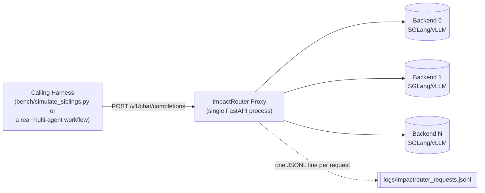
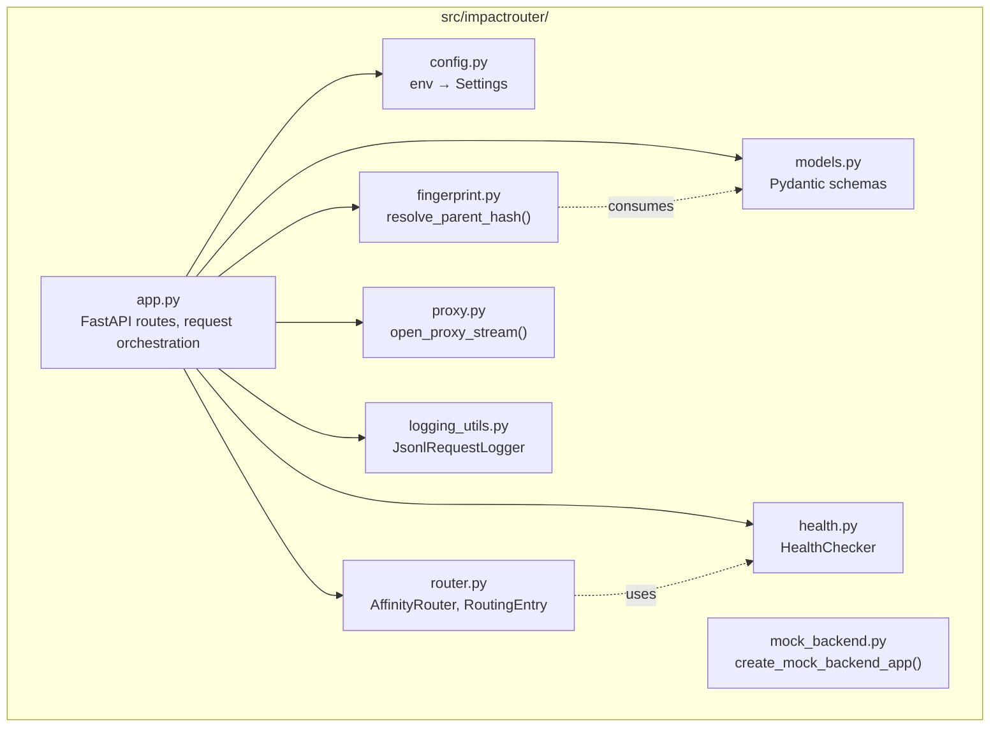
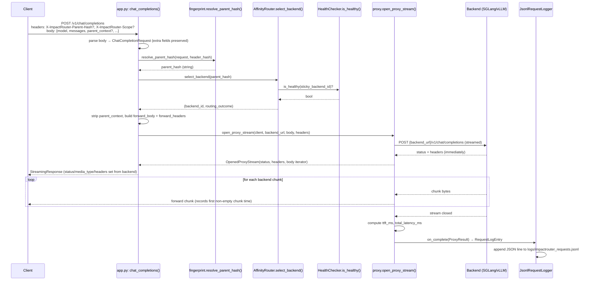
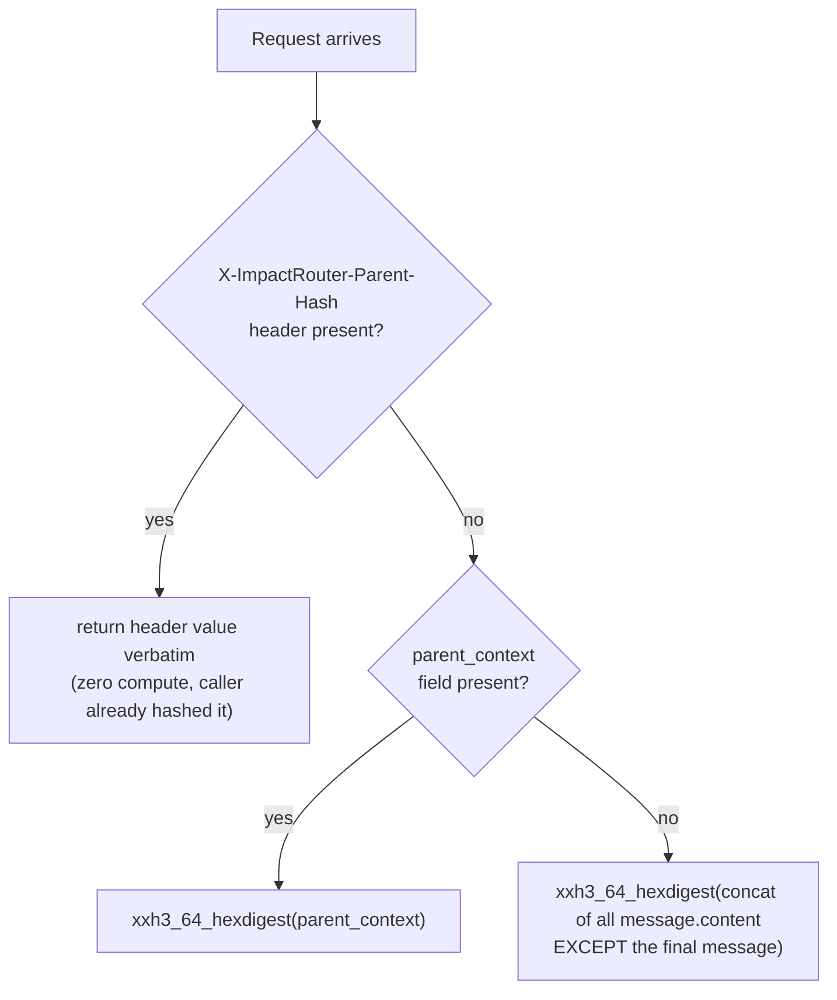
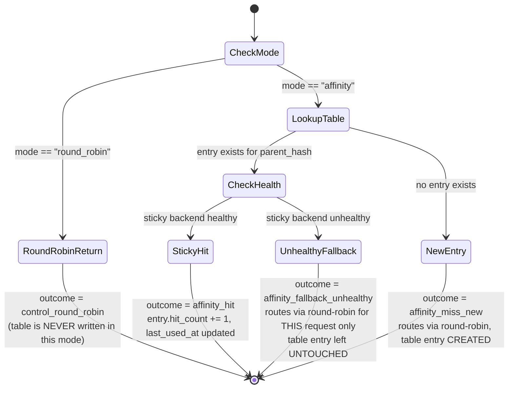
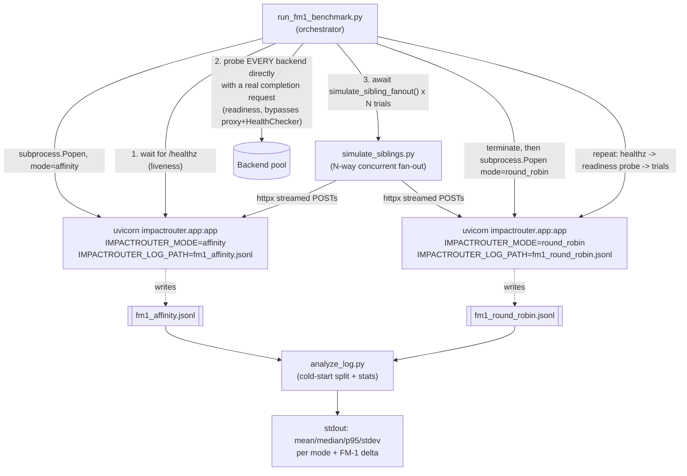

# ImpactRouter — Architecture (Implementation SSOT)

**Status:** Living document. **Source of truth for:** how ImpactRouter v1 is actually built (modules, data flow, algorithms, invariants).
**Not the source of truth for:** *why* ImpactRouter exists or what's in/out of scope for v1 — that's [`PRD.md`](../PRD.md). This document assumes you've read the PRD; it does not re-litigate goals or non-goals, it describes the implementation that satisfies them.

> **Keeping this document in sync:** whenever a module's responsibility, a data shape, or a control-flow decision changes, update the relevant section of this file in the same change. If this document and the code disagree, the code is correct and this document is stale — fix the document, don't treat the drift as acceptable.

---

## 1. System Context

ImpactRouter is a single-process, in-memory FastAPI proxy. One event loop, one `httpx.AsyncClient`, one routing table, one log file. It sits between a calling harness (or the benchmark harness) and a pool of OpenAI-compatible backends, and makes exactly one decision per request: **which backend does this request go to**, based on a hash of its "parent" context.



---

## 2. Component Architecture



Every arrow is a real import, not an aspiration — `app.py` is the only module that composes the others; none of `fingerprint.py`, `router.py`, `proxy.py`, `health.py`, or `logging_utils.py` import each other. This is deliberate: each module is independently unit-testable with plain Python values (see Section 10).

---

## 3. Request Lifecycle

This is the sequence for one `POST /v1/chat/completions` call, as implemented in `chat_completions()` in `app.py`.



**Key invariant:** the client-facing `StreamingResponse` is constructed with the *real* backend status code and `Content-Type` (so a `4xx`/`5xx` from the backend, or a non-SSE response, passes through faithfully) — this requires opening the backend stream and reading its headers *before* constructing the response object. See Section 6.3 for why this needs a two-phase design instead of the naive single-generator version sketched in the PRD.

---

## 4. Module Reference

| Module | Responsibility | Public surface |
|---|---|---|
| `config.py` | Reads `IMPACTROUTER_*` env vars into an immutable `Settings` dataclass. Owns the `backend_0`, `backend_1`, ... ID scheme. | `load_settings()`, `Settings` |
| `models.py` | Pydantic v2 schemas for requests, log entries, and stats responses. `extra="allow"` on request models so unknown OpenAI fields pass through untouched. | `ChatCompletionRequest`, `Message`, `RequestLogEntry`, `RouterStatsResponse`, `BackendStats`, `HealthResponse` |
| `fingerprint.py` | Pure function: header → `parent_context` → message-fallback precedence, xxHash3 hashing. No I/O, no state. | `resolve_parent_hash(request, header_hash) -> str` |
| `router.py` | In-memory sticky routing table + round-robin fallback + mode toggle. No I/O; health status is injected via a callback so this module has zero coupling to `httpx`. | `AffinityRouter`, `RoutingEntry` |
| `health.py` | Background asyncio task that polls each backend's `/health` on an interval and caches a boolean per backend. | `HealthChecker` |
| `proxy.py` | Opens a streamed backend request, exposes status/headers immediately, wraps the byte iterator to measure TTFT and fire a completion callback once fully consumed. | `open_proxy_stream()`, `OpenedProxyStream`, `ProxyResult` |
| `logging_utils.py` | Appends one JSON line per request to the configured log path. Thread-safe-ish via an `asyncio.Lock` + `asyncio.to_thread` for the blocking file write. | `JsonlRequestLogger` |
| `mock_backend.py` | A trivial OpenAI-shaped SSE echo server with configurable artificial latency. Used by tests (in-process via `httpx.ASGITransport`) and standalone as a real process for manual/mixed-pool testing. | `create_mock_backend_app()`; also runnable directly as `python -m impactrouter.mock_backend`, a `__main__` entrypoint that reads `MOCK_BACKEND_PORT` (default `9000`) and `MOCK_BACKEND_INITIAL_DELAY_S` (default `0.05`) from the environment — this is what `E2E_TESTING.md` Tiers 2–3 run as a standalone process |
| `app.py` | Composes everything above into FastAPI routes. Owns the one `AppState` per process (routing table, health checker, http client, logger). | `create_app()`, `app` |

---

## 5. Data Models

### 5.1 Request shape (`ChatCompletionRequest`, `Message`)

Standard OpenAI chat completion shape plus two ImpactRouter-specific optional fields. `extra="allow"` on both `Message` and `ChatCompletionRequest` means any field the proxy doesn't explicitly model (e.g. `temperature`, `top_p`, `tool_calls`, `logit_bias`) survives `model_dump()` and is forwarded to the backend unchanged.

```python
class Message(BaseModel):
    model_config = ConfigDict(extra="allow")
    role: str
    content: str | None = None

class ChatCompletionRequest(BaseModel):
    model_config = ConfigDict(extra="allow")
    model: str
    messages: list[Message]
    stream: bool = True
    parent_context: str | None = None    # consumed by ImpactRouter, stripped before forwarding
    sibling_index: int | None = None     # consumed by ImpactRouter, stripped before forwarding
```

`sibling_index` is a 0-based, caller-assigned dispatch-order index (set by `bench/simulate_siblings.py` when it fans out N concurrent siblings). Like `parent_context`, `app.py` strips it before forwarding the request to the backend and instead threads it into the corresponding `RequestLogEntry` (Section 5.3) — it exists purely so `bench/analyze_log.py` can classify cold-start vs. sibling requests by dispatch order rather than completion order (Section 9).

### 5.2 Routing state (`RoutingEntry`, in `router.py`)

```python
@dataclass
class RoutingEntry:
    parent_hash: str
    backend_id: str
    created_at: float
    last_used_at: float
    hit_count: int = 0
```

One entry per distinct `parent_hash` ever seen, for the lifetime of the process. No TTL, no eviction (PRD Non-Goals — restart resets state).

### 5.3 Log line (`RequestLogEntry`)

One line per request in `logs/impactrouter_requests.jsonl` (path configurable via `IMPACTROUTER_LOG_PATH`). **This schema is a contract with `bench/analyze_log.py` — every field must always be present on every line** (fields may hold `null`, per below, but must never be missing).

| Field | Type | Notes |
|---|---|---|
| `timestamp` | ISO-8601 string (UTC) | Set at `on_complete` time, i.e. after the full response has streamed. **This is completion time, not dispatch time** — do not use it to reconstruct dispatch/sibling order (see `sibling_index` below and Section 9) |
| `request_id` | 8-hex-char string | `uuid4().hex[:8]`, per-request, not globally unique but sufficient for log correlation |
| `parent_hash` | string | The xxHash3 digest used for routing, regardless of routing mode |
| `scope` | string \| null | From `X-ImpactRouter-Scope`, observability-only (never affects routing) |
| `backend_id` | string | `backend_0`, `backend_1`, ... — the backend actually used for this request |
| `routing_mode` | `"affinity"` \| `"round_robin"` | The proxy's configured mode at request time |
| `routing_outcome` | `"affinity_hit"` \| `"affinity_miss_new"` \| `"affinity_fallback_unhealthy"` \| `"control_round_robin"` | See Section 6.2. `affinity_miss_new` = true cold start (parent_hash never seen); `affinity_fallback_unhealthy` = parent_hash was seen before but its sticky backend is currently unhealthy — distinct from a cold start so health blips are visible in the log |
| `ttft_ms` | float \| null | Null only if the backend returned an empty response body |
| `total_latency_ms` | float | Always set |
| `prompt_char_len` | int | `sum(len(message.content))` + `len(parent_context)` — **character count, not token count** — a cheap proxy for prefix size, not a tokenizer-accurate one |
| `sibling_index` | int \| null | From `ChatCompletionRequest.sibling_index` (Section 5.1): the caller-assigned, 0-based dispatch-order index within a sibling fan-out. `null` if the caller didn't set it (e.g. ad hoc Tier 2 manual testing). **This, not `timestamp`, is the primary signal `bench/analyze_log.py` uses to classify cold-start vs. sibling requests** — see Section 9 |

### 5.4 Introspection (`RouterStatsResponse`, `BackendStats`)

`GET /v1/router/stats` response: current mode, routing table size, and per-backend `{backend_id, backend_url, healthy, hit_count}`, where `hit_count` is the **sum of `hit_count` across all routing-table entries currently pointing at that backend** (not a lifetime counter — it reflects only entries still resident in the in-memory table).

---

## 6. Core Algorithms

### 6.1 Fingerprint Resolution (`fingerprint.py`)

Pure, deterministic, three-tier precedence:



- **No I/O, no mutation, no randomness.** Same `(request, header_hash)` in ⇒ same hash out, forever, within a process — this is the property `tests/test_fingerprint.py` exists to pin down.
- The fallback tier exists so unmodified OpenAI clients still get *some* affinity benefit, at reduced quality (it can't distinguish "these two requests differ only in role instruction" from "these two requests are about completely different topics but happen to have the same number of messages").
- The header tier is a zero-cost escape hatch for callers who've already computed sibling identity themselves (e.g. by tagging all Phase 3 tournament calls for a given idea with the same explicit hash).

### 6.2 Affinity Routing (`router.py`)

`AffinityRouter.select_backend(parent_hash)` is the entire mechanism. State machine:



Three properties worth calling out because they're easy to get wrong and are exactly what `tests/test_router.py` locks down:

1. **Health-check failure never corrupts the table.** If `parent_hash`'s sticky backend is currently unhealthy, this request round-robins elsewhere, but the table still says "this parent belongs on the original backend." The very next request for the same `parent_hash`, once that backend is healthy again, goes right back to it. This is intentional — a transient health blip shouldn't permanently reassign a parent's affinity.
2. **`round_robin` mode never touches the table at all** — not "ignores it for routing purposes," but literally never reads or writes `self.table`. This makes the two modes trivially comparable in the benchmark: the table is either the entire routing mechanism (`affinity`) or entirely inert (`round_robin`), with no partial-state leakage between runs of the same process.
3. **A true cold start (`NewEntry`, `affinity_miss_new`) and a known-but-currently-unhealthy sticky backend (`UnhealthyFallback`, `affinity_fallback_unhealthy`) are distinct outcomes, not the same label.** Both round-robin under the hood to pick a backend, but they mean different things: one is "this parent has never been seen," the other is "this parent has affinity, but we couldn't honor it this time." Collapsing them into a single `affinity_miss_new` value (an earlier version of this router did exactly that) makes it impossible to tell from the log alone whether a health blip occurred during a benchmark run — see `tests/test_router.py::test_new_parent_hash_is_distinct_from_unhealthy_sticky_fallback`.

Round-robin backend selection itself (`_next_round_robin`) is a plain `self.backends[counter % len(self.backends)]` — no load signal, no health awareness (health only gates whether a *sticky* choice is honored, not which backend round-robin picks next). This is intentional per PRD §6.5 — v1 health checking exists to protect affinity correctness, not to build a load-aware balancer.

### 6.3 Streaming Proxy & TTFT Measurement (`proxy.py`)

The PRD's reference implementation (§6.4) uses a single `async for` loop that both forwards bytes and computes TTFT inline. The actual implementation splits this into two phases, because the client-facing FastAPI `StreamingResponse` needs the backend's real status code and `Content-Type` *before* it's constructed — and you can't get those without already opening the backend stream.

```python
opened = await open_proxy_stream(...)   # phase 1: connects, gets status+headers, returns immediately
# opened.status_code / opened.response_headers are real backend values, known now
return StreamingResponse(opened.body, status_code=opened.status_code, media_type=..., headers=...)
# phase 2: opened.body is only actually iterated once FastAPI starts sending the response
```

Internally, `open_proxy_stream`:
1. Manually enters the `httpx.AsyncClient.stream(...)` async context manager (`stream_cm.__aenter__()`) rather than using `async with`, so it can return control to the caller with the response headers already in hand while the connection stays open.
2. Returns a `body` async generator that, on each chunk, checks `first_token_time is None and chunk.strip()` — TTFT is measured against the first **non-empty** chunk, not the first chunk overall (SSE keep-alive/empty chunks don't count as "the first token").
3. In a `finally` block (guaranteed to run whether the consumer finishes normally, throws, or disconnects early), exits the context manager (`stream_cm.__aexit__`) and fires `on_complete(ProxyResult)` with `ttft_ms` / `total_latency_ms` / `status_code` / `response_headers`.

**Why `on_complete` fires from inside the generator's `finally`, not from `app.py` after the request handler returns:** FastAPI's `StreamingResponse` drives the generator itself, on its own schedule, after the route handler has already returned. There is no hook in `app.py` that runs "after the last byte is sent" — the generator's own `finally` is the only reliable place to know the stream is truly done (including on client disconnect, which still triggers `finally` via `GeneratorExit`).

Response headers are filtered on the way through (`_EXCLUDED_RESPONSE_HEADERS = {content-length, content-encoding, transfer-encoding, connection}`) because httpx already transparently decodes the backend's transport encoding, and the proxy is re-chunking the stream — forwarding the backend's original `Content-Length` would describe a byte count that no longer matches what's actually sent.

### 6.4 Health Checking (`health.py`)

`HealthChecker` is a single background `asyncio.Task` (started in the FastAPI `lifespan`, cancelled on shutdown) that loops: poll every backend's `GET {base_url}{health_path}` concurrently within one `httpx.AsyncClient`, cache `status_code < 500` as the boolean, sleep `interval_s`, repeat. Between polls, `is_healthy(backend_id)` is an O(1) dict lookup — the router never blocks on a network call to make a routing decision.

Startup assumption: every backend is assumed healthy until the first poll completes (`{bid: True for bid in ...}` at construction), so a request arriving before the first health poll finishes still gets routed rather than rejected — v1 prefers optimistic availability over strict pre-validation.

**Liveness vs. readiness (important, and easy to get wrong with real inference backends):** `HealthChecker` is a *liveness* check — it confirms a backend's HTTP server is answering, nothing more. `IMPACTROUTER_HEALTH_PATH` defaults to `/health`, which for SGLang returns `200` as soon as the process is listening, **before model weights have necessarily finished loading**. SGLang also exposes `/health_generate`, which performs an actual single-token generation and therefore confirms the model can really serve a request — if you want `HealthChecker`'s own polling to reflect real readiness rather than bare liveness, point `IMPACTROUTER_HEALTH_PATH` at `/health_generate` instead. This is a configuration choice, not a code change, and it's worth doing for real backend pools.

That said, ImpactRouter's `HealthChecker` is **not** the authoritative readiness gate for the benchmark harness, for two reasons: (1) `/health_generate`'s exact semantics have shifted across SGLang versions (it briefly behaved identically to `/health` in some releases — see [sgl-project/sglang#12731](https://github.com/sgl-project/sglang/issues/12731) — so depending on it exclusively is fragile across engine versions), and (2) this proxy is meant to work against any OpenAI-compatible backend, not just SGLang, and there's no universal deep-readiness endpoint across engines. The authoritative fix lives in `bench/run_fm1_benchmark.py` instead — see Section 9's readiness smoke-probe, which sends a real completion request directly to each backend (bypassing both `HealthChecker` and whatever `/health`-style endpoint is configured) before any trial runs.

### 6.5 Logging (`logging_utils.py`)

`JsonlRequestLogger.log()` serializes a `RequestLogEntry` with Pydantic's `model_dump_json()`, then appends it via `asyncio.to_thread` (so the blocking `open()/write()/fsync()` doesn't stall the event loop) guarded by an `asyncio.Lock` (so concurrent sibling requests — the exact workload this proxy exists for — don't interleave partial lines into the file). `fsync()` after every write trades a small amount of throughput for the log surviving an unclean shutdown mid-benchmark.

---

## 7. Configuration Surface (`config.py`)

All configuration is env-var-driven, read once at `load_settings()` time into an immutable `Settings` dataclass — no live-reload, no config file.

| Env var | Default | Consumed by |
|---|---|---|
| `IMPACTROUTER_BACKENDS` | `http://localhost:30000` | `Settings.backends` / `.backend_ids` / `.backend_id_to_url` |
| `IMPACTROUTER_MODE` | `affinity` | `AffinityRouter.mode` |
| `IMPACTROUTER_PORT` | `8000` | not read by the app itself — pass `--port` to `uvicorn` explicitly; this var exists for orchestration scripts to agree on a port |
| `IMPACTROUTER_HEALTH_CHECK_INTERVAL_S` | `5.0` | `HealthChecker` poll interval |
| `IMPACTROUTER_HEALTH_PATH` | `/health` | Path appended to each backend URL for health polling |
| `IMPACTROUTER_LOG_PATH` | `logs/impactrouter_requests.jsonl` | `JsonlRequestLogger` |
| `IMPACTROUTER_BACKEND_TIMEOUT_S` | `120.0` | Per-request timeout passed to `httpx` for the backend call |

`backend_ids` are always positional and derived, never configured: `backends[i]` ↔ `backend_i`. This is intentional — it keeps `IMPACTROUTER_BACKENDS` as the single knob that defines pool membership, ordering, *and* naming, with no way for the ID scheme and the URL list to drift out of sync.

---

## 8. Process & Concurrency Model

- **One process, one event loop** (PRD explicit requirement). No multi-worker `uvicorn`, no shared state across processes.
- **One `httpx.AsyncClient`** shared across all requests (created in `AppState.__init__`, closed in the `lifespan` shutdown handler) — this reuses connection pools to each backend rather than opening a new TCP connection per request.
- **One `AffinityRouter` instance, one routing table (`dict`)** — safe under `asyncio` concurrency because there's no `await` between reading and mutating `self.table` inside `select_backend`; it's synchronous code that happens to run inside an async function, so there's no interleaving hazard even with many concurrent sibling requests hitting it "simultaneously" (they're still serialized by the single event loop at the points where the dict is touched).
- **One `HealthChecker` background task**, independent of request-handling coroutines.
- **The JSONL logger's `asyncio.Lock`** is the one place true interleaving is possible (the file write itself is offloaded to a thread pool via `asyncio.to_thread`), and it exists specifically to keep concurrent sibling requests' log lines from corrupting each other.

---

## 9. Benchmark Harness Architecture (`bench/`)



**Why the orchestrator spawns two separate proxy subprocesses instead of one long-lived proxy with a runtime mode-flip:** `AffinityRouter.mode` and `IMPACTROUTER_LOG_PATH` are both fixed at process-construction time by design (Section 7 — no live-reload). Rather than add a live-toggle API surface purely for benchmarking (which the PRD doesn't call for and which would blur "is this proxy's mode configuration a runtime concern or a startup concern"), `run_fm1_benchmark.py` owns the full lifecycle: launch → wait-healthy → probe-backends-ready → N trials → terminate, once per mode, each writing to its own log file. This also means every benchmark run starts from a genuinely empty routing table for each mode, rather than a table that's accumulated state from whichever mode ran first.

**Readiness smoke-probe (`_probe_all_backends_ready`, between "wait-healthy" and "N trials" above):** before starting either mode's trial loop, `run_fm1_benchmark.py` sends one real, minimal, non-streaming completion request **directly to every backend in the pool, bypassing the proxy entirely** (`_probe_backend_ready` in `bench/run_fm1_benchmark.py`), and blocks until every backend answers with `200` or a configurable `--readiness-timeout-s` (default 120s) elapses. This runs **once per mode-subprocess-launch**, not once globally — the backends themselves are long-running across both mode runs, but each proxy launch re-confirms they're actually able to generate before trials against that configuration begin.

This exists as a distinct, stronger check than `HealthChecker`/`/healthz` (Section 6.4): a shallow liveness check can report success as soon as a backend's HTTP server is listening, well before a real inference engine has finished loading model weights and can actually generate — and Tier 5's early trials would otherwise silently measure a cold, half-initialized backend instead of a steady-state one. On timeout, the probe raises a `RuntimeError` naming the exact backend URL and the last error observed (connection refused, timeout, non-200 status, etc.) rather than hanging silently or raising a generic timeout — see `bench/run_fm1_benchmark.py::_probe_backend_ready`'s docstring.

**Why every trial gets a fresh `idea_id`:** if trial 2 reused trial 1's `idea_id`, its "first" sibling request would compute the exact same `parent_hash` and (in affinity mode) find an already-warm table entry from trial 1 — silently converting what should be a fresh cold-start into a hit. `_run_trials` generates `idea_id = f"fm1_{mode}_{run_id}_{trial_index}"` specifically to keep every trial's parent hash unique.

**Cold-start-vs-sibling split (`analyze_log.py::classify_cold_start_vs_sibling`):** group all log entries by `parent_hash`, then classify each group. The **primary signal is `sibling_index`** (Section 5.1/5.3): `bench/simulate_siblings.py` assigns every request an explicit, 0-based, dispatch-order index when it fans a trial out, and `run_fm1_benchmark.py`'s trials always populate it — when every entry in a group has `sibling_index` set, index `0` is the cold start and every other index is a sibling, full stop.

This is dispatch order, not completion order, and that distinction is load-bearing: `simulate_siblings.py` fires all N siblings concurrently via `asyncio.gather`, so under real backend load — which is exactly the condition this proxy exists to help with — completion order can legitimately diverge from dispatch order. A warm sibling in `affinity` mode can finish its entire response before the cold-start request (still prefilling the full shared prefix from scratch) finishes. **An earlier implementation sorted by `timestamp` (completion time) instead of `sibling_index`**, which meant a fast-finishing warm sibling could be mislabeled as the cold start — or the genuinely cold request mislabeled as a sibling — silently corrupting the exact split the FM-1 measurement depends on. This was found and fixed before any real (Tier 4/5) benchmark run; see `tests/test_analyze_log.py` for the regression test that pins this down (constructs a group where `sibling_index` order and `timestamp` order disagree and asserts classification follows `sibling_index`).

`timestamp`-sort is retained only as a **fallback**, used when `sibling_index` is missing on some or all entries in a group (e.g. ad hoc Tier 2 manual `curl` testing, which has no reason to set it and isn't exercising real concurrent fan-out in the first place). This keeps the log schema mode-agnostic — it means the same thing whether the proxy is in `affinity` or `round_robin` mode — while giving real benchmark runs a precise, concurrency-safe classification.

---

## 10. Testing Architecture

| Test file | Layer | Technique |
|---|---|---|
| `tests/test_fingerprint.py` | Pure function | Direct calls, no mocking needed — `resolve_parent_hash` has no I/O |
| `tests/test_router.py` | Pure in-memory state machine | Direct calls with an injected `health_check` callable (a plain closure over a `set[str]` of unhealthy IDs) — no `httpx`, no event loop needed for the assertions that matter |
| `tests/test_proxy_streaming.py` | Integration (streaming + timing) | `httpx.ASGITransport(app=create_mock_backend_app(...))` — runs the mock backend *in-process*, no real sockets, so timing assertions (`ttft_ms < total_latency_ms`) are fast and deterministic-enough while still exercising the real `httpx.AsyncClient.stream()` code path |
| `tests/test_analyze_log.py` | Pure function | Direct calls to `bench/analyze_log.py::classify_cold_start_vs_sibling` with synthetic `RequestLogEntry` dicts (imported via a `sys.path` insert of `bench/`, the same pattern `run_fm1_benchmark.py` uses to import `simulate_siblings`). Includes the regression test for the P0 out-of-order-completion bug (Section 9) |

`tests/conftest.py` provides one fixture, `make_request`, a factory for `ChatCompletionRequest` objects with sensible defaults — used across all fingerprint tests to avoid repeating message-list boilerplate.

**Deliberately not unit-tested** (per PRD §13): `bench/*.py`. These are validated by running a short trial (e.g. `--trials 3`) against the mock backend and eyeballing the output before committing to a real 30+ trial run — see [`E2E_TESTING.md`](./E2E_TESTING.md) for the exact commands.

---

## 11. Failure Modes & Edge Cases Handled

| Scenario | Behavior |
|---|---|
| Sticky backend goes unhealthy mid-benchmark | Router falls back to round-robin for that request only; table entry is preserved (Section 6.2) |
| Backend returns non-2xx | Status code and body pass through to the client verbatim (proxy doesn't inspect or retry) |
| Backend returns an empty body | `ttft_ms` is logged as `null` (no chunk ever satisfied `chunk.strip()`) rather than a fabricated number |
| Client sends a field the proxy doesn't model (e.g. `temperature`) | Preserved via `extra="allow"` and forwarded untouched |
| Client sends neither `X-ImpactRouter-Parent-Hash` nor `parent_context` | Falls back to hashing all-but-last message content (Section 6.1) — proxy still works, affinity quality is just lower |
| `messages` has exactly one entry | Fallback hash is over an empty string (`messages[:-1]` is `[]`) — deterministic, just low-signal; not a crash |
| Client disconnects mid-stream | Generator's `finally` still runs (via `GeneratorExit`), so `ttft_ms`/`total_latency_ms` are still logged for the partial request |
| Two sibling requests arrive "simultaneously" | Single event loop serializes the actual table read/write; no race condition on `select_backend` (Section 8) |

---

## 12. Explicit Non-Goals (Restated From the PRD)

This document does not re-derive these, it restates them because they constrain the architecture directly: **no persistence** (table and log are the only state, and the log is append-only/write-only from the app's perspective — never read back by the running process), **no multi-process/multi-worker deployment**, **no load-based or latency-weighted backend selection**, **no cache-purge or speculative-warming endpoints**, **`X-ImpactRouter-Scope` never influences routing** (it flows from `app.py` straight into `RequestLogEntry.scope` and nowhere else — grep for `scope` in `router.py` or `fingerprint.py` and you will find nothing, by design). Full rationale in [`PRD.md`](../PRD.md) §4.

---

## 13. Explicit Extension Points (Not Implemented — Design Left Open For)

These are called out so a future change knows where it's *expected* to slot in, without this document pretending they exist today:

- **Scope-based routing (v2):** `X-ImpactRouter-Scope` is already parsed and logged (Section 5.3) but never passed into `AffinityRouter`. If this becomes in-scope, it enters at the `select_backend(parent_hash, scope=...)` call site in `app.py` — the router's internal table keying would need a design decision (compound key vs. secondary index) at that point, not before.
- **Persistent routing table:** `AffinityRouter.table` is a plain `dict`. Swapping in a persistent store means changing `AffinityRouter`'s internal storage only — `select_backend`'s external contract (`parent_hash -> (backend_id, outcome)`) wouldn't need to change.
- **Load-aware backend selection:** `_next_round_robin` and `_is_healthy` are the only two seams that decide "which backend," both isolated inside `router.py`. A latency-weighted selector would replace `_next_round_robin`'s body without touching `select_backend`'s control flow.
- **`/v1/cache/purge`:** explicitly deferred (PRD §4); would be a new route in `app.py` plus a new method on `AffinityRouter` to evict table entries — no existing code needs to change to add it later.

---

## 14. File Map

```
impactrouter/
├── PRD.md                          Requirements SSOT (why + what, not how)
├── docs/
│   ├── ARCHITECTURE.md             This document (how)
│   ├── E2E_TESTING.md              Runnable command reference
│   └── fm1_benchmark_writeup.md    Filled in after a real benchmark run
├── src/impactrouter/
│   ├── app.py                      FastAPI routes + request orchestration
│   ├── config.py                   Env → Settings
│   ├── models.py                   Pydantic schemas
│   ├── fingerprint.py              Parent-hash resolution
│   ├── router.py                   AffinityRouter + RoutingEntry
│   ├── health.py                   Backend health polling
│   ├── proxy.py                    Streaming passthrough + TTFT capture
│   ├── logging_utils.py            JSONL request logger
│   └── mock_backend.py             Echo backend for tests / manual E2E
├── bench/
│   ├── simulate_siblings.py        N-way concurrent sibling fan-out
│   ├── run_fm1_benchmark.py        Two-mode subprocess orchestrator
│   └── analyze_log.py              Cold-start split + summary stats
├── tests/
│   ├── conftest.py
│   ├── test_fingerprint.py
│   ├── test_router.py
│   └── test_proxy_streaming.py
└── logs/                           gitignored; *.jsonl written at runtime
```
